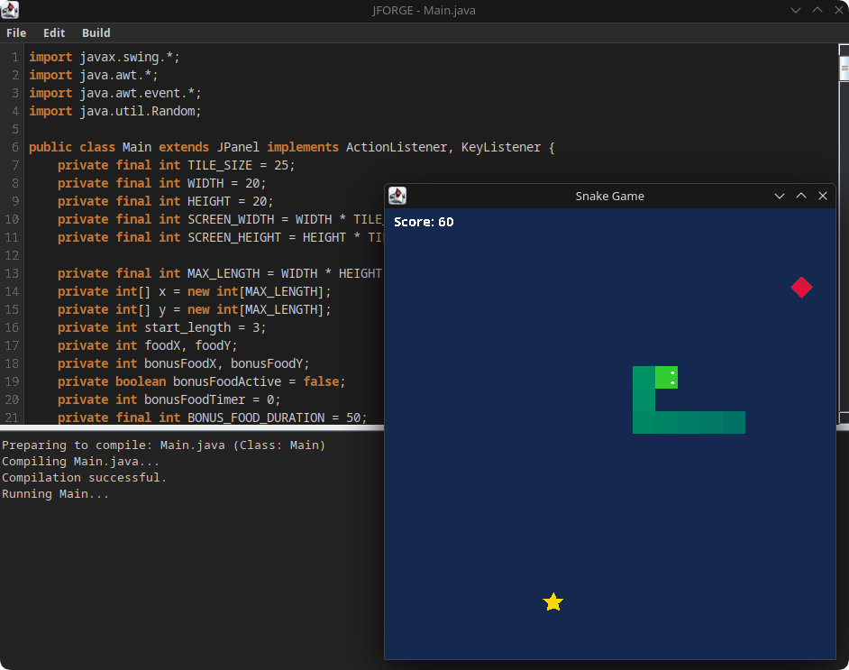
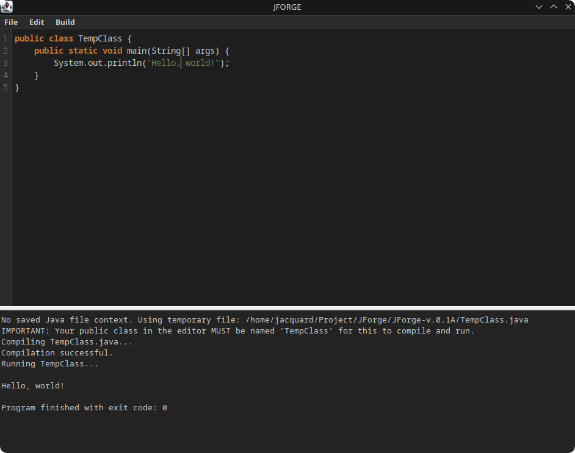

<div align="center">


# JForge - IDE written in Java for Java 

**Version: v.0.1A**

[](https://github.com/YourUsername/JForge)
[](https://www.java.com/)
[](https://docs.oracle.com/javase/8/docs/api/javax/swing/package-summary.html)
[](https://docs.oracle.com/en/java/javase/17/docs/api/java.compiler/javax/tools/JavaCompiler.html)
[](LICENSE)

**JForge** is a lightweight, cross-platform Integrated Development Environment (IDE) for Java, built entirely with Java Swing. It provides a clean, modern dark interface for comfortably writing, compiling, and running Java code, making it an excellent tool for learning and small projects.

**[🌐 Visit Project Website](https://jforge-site.vercel.app/)**

</div>

---

## 📸 Screenshots

<div align="center">
<table>
  <tr>
    <td></td>
    <td></td>
  </tr>
  <tr>
    <td align="center"><em>Main interface with syntax highlighting</em></td>
    <td align="center"><em>The first "Hello, world!" in JForge's history</em></td>
  </tr>
</table>
</div>

---

## ✨ Key Features

-   **Built-in Compilation and Execution**: Compile and run your Java code with a single keystroke (F5), with results and errors displayed in an integrated console.
-   **Syntax Highlighting**: Automatic highlighting of Java keywords, strings, and comments to improve code readability.
-   **Modern Dark Theme**: A meticulously configured dark interface for all UI components, reducing eye strain.
-   **File Management**: A full suite of operations: create, open, save, and "save as...".
-   **Data Loss Protection**: The IDE automatically prompts to save unsaved changes before closing a file or exiting.
-   **Useful Editor Features**:
    -   Line numbering.
    -   Undo/Redo functionality.
    -   Automatic UI adjustment to window size.
-   **Standalone**: Requires no external dependencies other than an installed JDK.
-   **Cross-platform**: Works wherever Java is installed (Windows, macOS, Linux).

---

## 🛠️ Tech Stack

| Category         | Technology                                                                                                             | Description                                                                 |
| :--------------- | :--------------------------------------------------------------------------------------------------------------------- | :-------------------------------------------------------------------------- |
| **Language/Platform** |                          | The main programming language and runtime environment.                      |
| **GUI**          |                                                   | A library for creating a graphical user interface.                          |
| **Compilation**  |                                             | The JDK's built-in API for programmatically compiling Java code.            |
| **UI Rendering** |                                                          | Abstract Window Toolkit, used by Swing for low-level rendering and events.  |

---

## 🚀 Getting Started

### Prerequisites

-   [Java Development Kit (JDK)](https://www.oracle.com/java/technologies/downloads/) version 8 or newer. **Important:** A JDK is required, not just a JRE, as JForge uses the compiler.
-   Ensure that `javac` and `java` are available from your command line.

### Compilation and Execution

1.  **Clone the repository:**
    ```bash
    git clone https://github.com/YourUsername/JForge.git
    cd JForge
    ```

2.  **Compile the source code:**
    Open a terminal in the project folder and run the command:
    ```bash
    javac Main.java
    ```

3.  **Run the application:**
    After successful compilation, run the command:
    ```bash
    java Main
    ```

---

## 📁 Project Structure

The project is intentionally contained within a single file for simplicity and clarity.

```
JForge/
│
└── Main.java     # All code: logic, UI, and helper classes
```

---

## 🔬 Detailed Code Breakdown

All code is located in the `Main.java` file, which contains two classes: `Main` and `TextLineNumber`.

### `Main` Class (The Heart of the Application)

-   **Constants and UI Setup (`applyDarkUIManagerSettings`)**: At the beginning of the class, color constants for the dark theme are defined. The `applyDarkUIManagerSettings` method uses `UIManager.put()` to globally apply these colors to all Swing components, creating a unified and cohesive look.
-   **`initComponents()`**: This method is responsible for creating and laying out the main interface elements:
    -   `JTextPane` (`editorPane`): The main field for code input and editing.
    -   `JTextArea` (`consoleArea`): A non-editable area for displaying compilation results and program output.
    -   `JSplitPane`: Divides the editor and the console, allowing the user to resize them.
    -   `TextLineNumber`: Adds a line number panel to the left of the editor.
-   **`setupMenu()`**: Creates the top menu ("File", "Edit", "Build") and binds the corresponding actions (`newFile`, `openFile`, `compileAndRun`, etc.) to its items using `ActionListeners`. Hotkeys (Ctrl+N, F5) are also configured here.
-   **File Operations (`newFile`, `openFile`, `saveFile`, `saveFileAs`)**: Implement the file handling logic. The `confirmClose()` method checks for unsaved changes and asks the user for confirmation, preventing accidental data loss.
-   **`compileAndRun()` (Key Method)**: Implements the IDE's main functionality.
    1.  It checks if the current code is saved. If not, it prompts to save.
    2.  If the file has not been saved to disk, the code is written to a temporary file named `TempClass.java`.
    3.  It gets the system Java compiler via `ToolProvider.getSystemJavaCompiler()`.
    4.  It starts the compilation, redirecting the error stream to a `ByteArrayOutputStream` for later output to the console.
    5.  If compilation is successful, it creates a new process using `ProcessBuilder` to run the compiled `.class` file (`java TempClass`).
    6.  The output and error streams of this process are captured and displayed in real-time in the `consoleArea`.
-   **`applyHighlighting()`**: The method responsible for syntax highlighting. It uses regular expressions (`Pattern` and `Matcher`) to find keywords, comments, and strings in the editor's text and applies the corresponding styles (`StyledDocument`) to them.

### `TextLineNumber` Class (Line Numbering)

-   This helper class is a `JComponent` that draws line numbers next to the `JTextPane` text area.
-   It "listens" for changes in the document (`DocumentListener`) and the component (`ComponentListener`, `PropertyChangeListener`) to automatically repaint when text is added/removed, or the window or font size changes.
-   **`paintComponent()`**: The main drawing method. It calculates which lines are currently visible and draws their numbers, synchronizing their position with the text in the editor.
-   **`updatePreferredWidth()`**: Dynamically calculates the required width for the line number panel based on the total number of lines in the document (e.g., 1000 lines require more space than 99).

---

## 💡 How It Works: Architecture

JForge is a classic desktop application built on the event-driven model of Java Swing.

1.  **Launch**: The `main` method creates an instance of `Main` (which is a `JFrame`) and makes it visible within the Swing Event Dispatch Thread (EDT).
2.  **Event Loop**: The application enters an event-waiting loop. All user interactions (keystrokes, mouse clicks, window resizing) generate events.
3.  **Event Handlers**: Special listener objects, attached to UI components, intercept these events. For example, clicking the "Save" menu item generates an `ActionEvent` that calls the `saveFile()` method. Typing in the editor generates a `DocumentEvent`, triggering `applyHighlighting()` and the repainting of the line numbers.
4.  **Compilation and Execution**:
    -   Pressing F5 calls `compileAndRun()`.
    -   This method runs on the main EDT, but to execute the compiled program, it launches a **separate system process** (`java MyClass`).
    -   To prevent the UI from "freezing" while waiting for the running program to finish, its output is read in a separate background thread (`new Thread(...)`).
    -   Data from this background thread is passed back to the EDT using `SwingUtilities.invokeLater` to safely update the `consoleArea`.

This architecture allows for a responsive interface that does not block during long-running operations like compiling and running user code.

---

## 📜 License

This project is distributed under the MIT License. See the `LICENSE` file for details.
