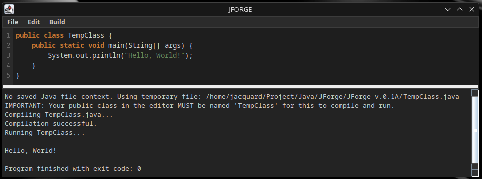
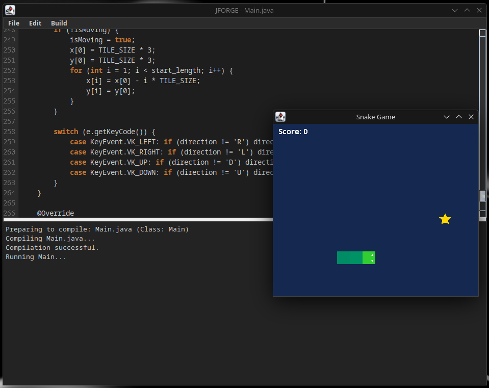

<p align="center">
  
</p>

<p align="center">
  
  
  
  <a href="https://opensource.org/licenses/MIT"></a>
  
  
</p>

<p>
⭐ Drop a star on my GitHub repo – it fuels my coding passion!
</p>

---

## ⚙️ Features

JForge v.0.1A comes packed with essential features to get you coding right away:

*   🎨 **Sleek Dark Theme:** A beautifully crafted dark user interface for comfortable coding, day or night. All standard Swing components are themed!
*   ✏️ **Java Syntax Highlighting:** Basic but effective highlighting for Java keywords, comments (single & multi-line), and strings.
*   🔄 **Undo/Redo:** Don't fear mistakes! Standard undo (Ctrl+Z) and redo (Ctrl+Y) are supported.
*   🔢 **Line Numbers:** Essential for any code editor, helping you navigate your code efficiently.
*   📂 **File Operations:**
    *   **New:** Start fresh with a new Java file.
    *   **Open:** Load existing `.java` files.
    *   **Save:** Save your work (Ctrl+S).
    *   **Save As:** Save your file with a new name or location (automatically suggests `.java` extension).
    *   **Unsaved Changes Prompts:** Never lose your work accidentally!
*   ⚙️ **Compile & Run Java Code:**
    *   Directly compile and run your Java code from within the IDE (F5).
    *   Requires a JDK to be installed and accessible.
    *   Supports compiling the currently open `.java` file or a temporary `TempClass.java` (if no file is open/saved, your public class must be named `TempClass`).
*   🖥️ **Integrated Console Output:** View compilation messages, errors, and your program's `System.out` directly within JForge.
*   ⌨️ **Keyboard Shortcuts:** Common actions like New (Ctrl+N), Open (Ctrl+O), Save (Ctrl+S), Undo (Ctrl+Z), Redo (Ctrl+Y), and Compile & Run (F5) have familiar shortcuts.
*   📏 **Customizable Split Pane:** Adjust the space between the editor and the console.
*   🚀 **Lightweight & Fast:** Built with pure Java Swing, ensuring a responsive experience.

---

## 📸 Screenshots


<p align="center">
  
  <br><em>JForge Main Interface: Editor, Console, and Menu.</em>
</p>

<p align="center">
  
  <br><em>Example of executable code with an additional window.</em>
</p>

---

## 🚀 Getting Started

Ready to forge some Java code? Here's how to get JForge up and running.

### Prerequisites

*   **Java Development Kit (JDK):** Version 8 or higher. JForge uses the system's Java compiler (`ToolProvider.getSystemJavaCompiler()`), so a full JDK (not just a JRE) is required.
    *   You can download it from [Oracle JDK](https://www.oracle.com/java/technologies/javase-downloads.html) or [OpenJDK](https://openjdk.java.net/install/).
    *   Ensure your `JAVA_HOME` environment variable is set and the JDK's `bin` directory is in your system's `PATH`.

### Running JForge

1.  **Download / Clone:**
    *   If a pre-compiled JAR is available (e.g., `JForge-v0.1A.jar`), download it.
    *   Alternatively, clone this repository:
        ```bash
        git clone https://github.com/Jacqquard/JForge-v.0.1A.git
        cd JForge-v.0.1A
        ```
2.  **Compile (if running from source):**
    Navigate to the directory containing `Main.java` and compile it:
    ```bash
    javac Main.java
    ```
3.  **Run:**
    *   **From JAR:**
        ```bash
        java -jar Main.jar
        ```
    *   **From compiled class files (if compiled from source):**
        ```bash
        java Main
        ```

And you're all set to start coding!

---

## 🛠️ How to Use

JForge aims for simplicity:

1.  **Writing Code:**
    *   Use **File > New** or `Ctrl+N` to start a new file.
    *   Use **File > Open** or `Ctrl+O` to open an existing `.java` file.
    *   The editor provides basic syntax highlighting for Java.
2.  **Saving Code:**
    *   Use **File > Save** or `Ctrl+S` to save your current work.
    *   Use **File > Save As...** to save with a new name. JForge will automatically append `.java` if not provided.
3.  **Compiling and Running:**
    *   Click **Build > Compile and Run** or press `F5`.
    *   **If a `.java` file is open and saved:** JForge will save any unsaved changes (after prompting), compile this file, and then run it. The public class name must match the filename.
    *   **If no file is open or it's an unsaved "New File":** JForge will attempt to save the content to a temporary `TempClass.java`, compile it, and run it.
        > ⚠️ **Important:** In this "temporary file" mode, your public class in the editor **MUST** be named `TempClass` for compilation and execution to succeed.
    *   Compilation errors, warnings, and program output will appear in the console area at the bottom.

---

## 💻 Tech Stack

JForge is built purely with:

*   **Java:** The core programming language.
*   **Java Swing:** For the graphical user interface.
*   **Standard Java Libraries:** No external dependencies for the core application!

---

## 🚧 Known Issues & Limitations (v.0.1A - Alpha)

As an early alpha release, JForge has some limitations:

*   **Basic Syntax Highlighting:** Does not cover all Java syntax nuances or provide semantic analysis.
*   **No Project Management:** Works on a single-file basis. No support for multi-file projects or build systems like Maven/Gradle.
*   **Limited Error Reporting:** Compiler errors are displayed as raw output; no direct linking to code lines yet.
*   **No Debugger:** Debugging features are not yet implemented.
*   **`TempClass` Restriction:** When compiling unsaved or new files, the main public class must be named `TempClass`.
*   **Single File Compilation:** Only compiles the currently active file.
*   **Performance:** While generally lightweight, performance with extremely large files hasn't been extensively tested.
*   **Theming:** While most common components are themed, some niche Swing components or platform-specific behaviors might not perfectly match the dark theme.

---

## 🛣️ Future Ideas / Roadmap

While JForge is simple by design, here are some potential enhancements for the future:

*   [ ] Enhanced Syntax Highlighting (more tokens, error highlighting)
*   [ ] Basic Code Completion
*   [ ] Find & Replace functionality
*   [ ] Customizable Fonts & Editor Settings
*   [ ] Tabbed interface for multiple files
*   [ ] Simple project structure support
*   [ ] Integration with a basic debugger
*   [ ] More theme options (e.g., light theme, user-customizable themes)
*   [ ] Improved error parsing and navigation from console to code

## 📝 License

Distributed under the MIT License. See `LICENSE` file for more information. (You'll need to add a LICENSE file to your repo, typically with the MIT license text).
